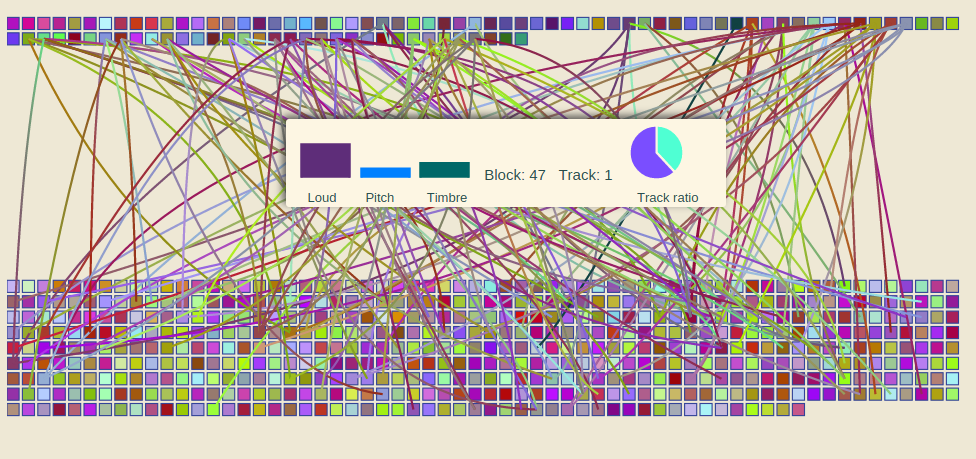

#SwitchBeat

##Check it out
<a href="http://kumarcode.com/switchbeat.html" alt="kumarcode.com/switchbeat">kumarcode.com/switchbeat.html</a>
##Examples
<a href="http://kumarcode.com/switchbeatexamples.html" alt="kumarcode.com/switchbeatexamples">kumarcode.com/switchbeatexamples.html</a>
##Uses
<ul>
<li> Raphaël.js </li>
<li> Chart.js </li>
</ul>

##Description
Takes any two songs that you supply and creates a mashup between them. 
###How it works
The program was inspired by the infinite jukebox. Music Analysis is done on
the Echonest servers. SwitchBeat uses this analysis to compare the beats of
both songs. Using this analysis it creates a normally distributed beat distance
dataset. Then using the parameters you specify it generates connections
between both songs.
###How to use it
####1. Select the parameters 
`%` for <b>music connections</b>: Increasing this will increase the number of
connections created. I have set the default to `5%`. 
`%` for <b>connection jump</b>: Increasing this will increase the chance that
SwitchBeat will jump on this connection. I have set the default to `30%`. 
`#` for <b>maximum connections per beat</b>: Increasing this will increase max
number of connections a beat can have. I have set the default to `4`. 
`on/off` for <b> Infinite Mode</b>: If it is on, when the program reaches the end
of one song it will jump to the start of another. I have set the default to
`on`. 
####2. Upload songs
You will be asked to upload your songs one by one. 
<ul>
<li> Please upload a .mp3, .flacs, .m4a, or .opus will not be
accepted</li>
<li> Try to upload in good quality 320 kbps or V0 is fine</li>
</ul>
####3. Wait for the analysis to finish
####4. Play the Mashup!

